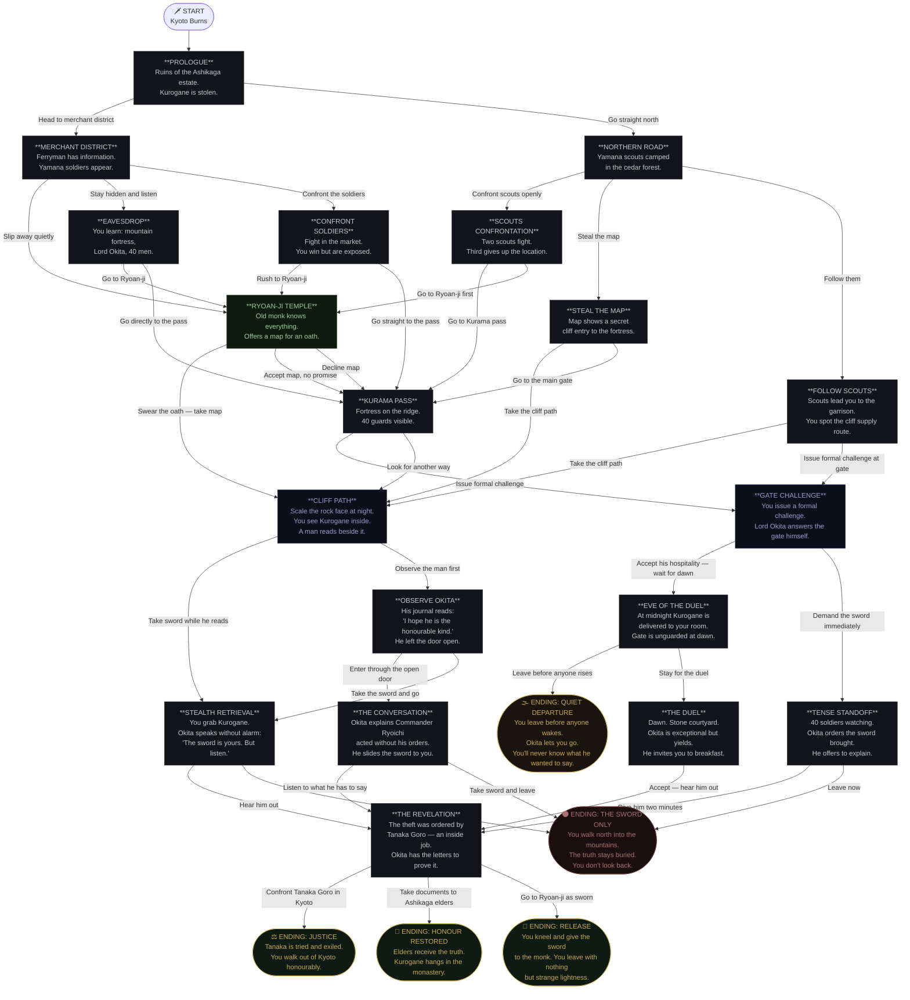

# Interactive Story Player

A cross-platform desktop application for playing branching narrative stories, built with C# and Avalonia UI. Stories are defined entirely in JSON — no recompilation needed to add new stories or change existing ones.


---

## Features

- **JSON-driven stories** — write or swap stories without touching code
- **Branching choices** — multiple choices per scene, each leading to a different path
- **Multiple endings** — scenes with no choices display an ending screen with a replay option
- **Save & load** — progress is saved to `AppData` and can be resumed at any time
- **Multiple images per scene** — each scene supports an `images` array or a single `image` field
- **Adaptive image layout** — portrait images appear on the right, landscape images appear on top, no images means full-width story view
- **Adjustable font size** — increase or decrease story text size with in-app controls
- **Hot reload** — editing the story JSON while the app is open automatically reloads it
- **Dark theme** — fully styled dark UI with hover and press effects on all buttons

---

## Getting Started

### Prerequisites

Install the .NET 8.0 SDK for your operating system:

**Windows**
```powershell
winget install Microsoft.DotNet.SDK.8
```

**macOS**
```bash
brew install --cask dotnet-sdk
```
> If you don't have Homebrew: `/bin/bash -c "$(curl -fsSL https://raw.githubusercontent.com/Homebrew/install/HEAD/install.sh)"`

**Ubuntu / Debian / Pop!_OS**
```bash
sudo apt update && sudo apt install -y dotnet-sdk-8.0
```
> If `dotnet-sdk-8.0` is not found in your repos:
> ```bash
> wget https://packages.microsoft.com/config/ubuntu/22.04/packages-microsoft-prod.deb
> sudo dpkg -i packages-microsoft-prod.deb
> sudo apt update && sudo apt install -y dotnet-sdk-8.0
> ```

**Fedora / RHEL**
```bash
sudo dnf install dotnet-sdk-8.0
```

**Arch Linux**
```bash
sudo pacman -S dotnet-sdk
```

**Verify installation**
```bash
dotnet --version
# should print 8.x.x
```

> **Linux only** — Avalonia requires this font package:
> ```bash
> sudo apt install -y libfontconfig1   # Debian/Ubuntu/Pop!_OS
> sudo dnf install -y fontconfig       # Fedora
> sudo pacman -S fontconfig            # Arch
> ```

---

### Run

```bash
git clone https://github.com/DeerajS2004/Interactive-Story-Player.git
cd Interactive-Story-Player
dotnet run
```

### Build

```bash
dotnet build -c Release
```

---

## Project Structure

```
InteractiveStoryPlayer/
├── Assets/
│   ├── story.json          # Default story file
│   └── images/             # Scene images (referenced in story.json)
├── Engine/
│   └── StoryEngine.cs      # Core engine: scene state, navigation, events
├── Models/
│   ├── Scene.cs            # Scene data model
│   ├── Choice.cs           # Choice data model
│   └── StoryRoot.cs        # Story root + metadata model
├── Services/
│   ├── StoryLoader.cs      # JSON loader with file watcher (hot reload)
│   └── SaveSystem.cs       # Save/load progress to AppData
└── UI/
    ├── MainWindow.axaml     # UI layout and styles
    └── MainWindow.axaml.cs  # UI logic and event handling
```

---

## Included Story — The Last Blade of Ashikaga

> *Kyoto, 1467. The Onin War has torn the capital apart. Your lord is dead, his sacred sword stolen. You are the last samurai of your clan — and the last one who can set things right.*

24 scenes, 5 distinct endings, multiple branching paths. The flowchart below maps every route through the story.



---

## Story JSON Format

Stories are plain JSON files. Place them anywhere and load via the app, or replace `Assets/story.json` as the default.

```json
{
  "meta": {
    "title": "My Story",
    "version": "1.0",
    "author": "Your Name"
  },
  "start": "scene_id",
  "scenes": {
    "scene_id": {
      "text": "The scene description shown to the player.",
      "images": ["images/scene.jpg"],
      "choices": [
        { "text": "Choice label", "next": "another_scene_id" },
        { "text": "Another choice", "next": "ending_scene_id" }
      ]
    },
    "ending_scene_id": {
      "text": "The story ends here.",
      "images": ["images/ending.jpg"],
      "choices": []
    }
  }
}
```

**Notes:**
- `start` — the ID of the first scene to display
- `images` — array of paths relative to the story JSON file's directory; falls back to a single `image` field for compatibility
- `choices: []` — an empty choices array marks a scene as an ending; the app shows a "Play Again" button automatically
- Portrait images (taller than wide) appear in a right-side panel; landscape images appear as a top banner; missing images hide the panel entirely

---

## Save File Location

| OS | Path |
|----|------|
| Windows | `%APPDATA%\InteractiveStoryPlayer\save.json` |
| Linux | `~/.config/InteractiveStoryPlayer/save.json` |
| macOS | `~/Library/Application Support/InteractiveStoryPlayer/save.json` |

---

## Built With

- [C#](https://learn.microsoft.com/en-us/dotnet/csharp/) — .NET 8.0
- [Avalonia UI](https://avaloniaui.net/) — 11.3.4, cross-platform UI framework

---

## License

MIT — see [LICENSE](LICENSE) for details.
